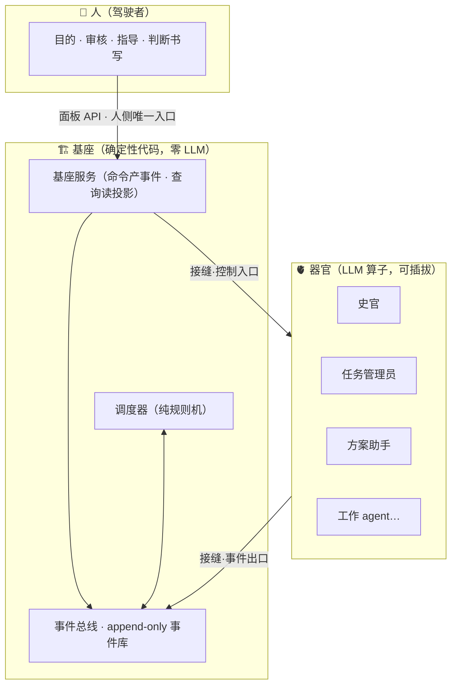

<div align="center">

# 🦾 ULM Base

**一个多 agent 的聚合协作平台：能够自由集成任何 agent/cli 的，拥有共享知识库 / 工作资源再生 / 任务再生 / 智能体迭代个性化专业化的，生命式流式工作体。**

*人类驾驶 AI，如同驾驶机甲——ULM 就是这台机甲的真实对应物。*


</div>

---

> 🧭 **我们在使用 AI 的同时，通过 AI 创造 AI、开发 AI。** 开发者（用户，不只是开发 AI 的开发者）、使用的 AI 工具/产品、新出现的 AI 产物——这三者构成一个复杂的关系与生态。ULM 属于「使用的 AI 工具/产品」范畴，被天然赋予三个使命。

## 🧭 三个使命

### 一 · 能力的延展——「驾驶」机甲

帮助用户借助 AI 工具和产品实现自身能力的延展：通过使用 AI，让自己能够实现徒手所不能做到的更多事情。人类驾驶 AI，做到一个人原先无法独自实现的事情——ULM 是人的手和身体的衍生与扩展，增大人的可触碰边界、力量、单位时间工作量（效率），极大增强人与世界的交互本身与交互流。

### 二 · 用户为本——全透明与最后保险

在这个生态关系中，**自始至终都是用户为本**，AI 终究只能是人的延伸、工具，而非能够代替人本身的产物。

- ULM 是**绝对服从用户的工具，不是黑箱，过程全透明**——每一步的最终决定权和控制权本质上都在人的手上
- 用户下发自身确定的权限，ULM 才能替代人完成权限内的重复工作——**用户是「大脑」，自动化是「脊柱」**，自动化对应「生效」这件事情的自动化
- ULM 与世界的交互应该属于用户，**用户应该知晓 ULM 与世界的每一次交互**
- 通过 ULM 学习，让用户的学习过程更高效——ULM 既加强传统学习，也可以是用户的学习对象本身

### 三 · 遗产

每一次使用 ULM，都是一次珍贵的人机交互实验。AI 与人都会留下宝贵的经验、记忆、体验与思维过程，通过时间有机地串联，成为**可复用的宝贵遗产**。

---

## 💎 核心设计思想

<table>
<tr><th width="50%">🌀 生命式流式工作体</th><th width="50%">🫀 整体才是核心</th></tr>
<tr><td>

- **再生与自我迭代**：与世界交互路径的优化与自我优化——这是目前的 agent 协作平台所没有的
- **流式**：流式地输入、运作、输出，产生效益并留下经验与资产
- **永远无法满足需求的机制**：有需求就会无限地去运作工作（价值体系：每个行为绑定价值变化，ULM 保持在固定价值位浮动、不越边界）
- **跟着时代潮流**：新出现的开源热点项目，自己分析，好的直接接入完成工具升级；大手术级概念经验累积到一定量，再决定是否发动对自身结构的革新

</td><td>

- 对机甲而言，**机甲是活的**——只要核心范式与核心器官还在，无论别的怎么变化，都还是它自己
- 除去必要的器官，其它器官都可以自由地**增生、变异、裁除**；甚至最重要的器官也可以变革形态结构，实现整体范式的进化
- 极高的**跨领域兼容**：换一个领域，装上对应的器官就能接着使用
- 每一个外来配好的独立 agent 或 agent 团队，**接入 ULM 即获得全部支持**；使用数据本地/云端，集合社区经验

</td></tr>
</table>

> **人永远是最后的保险。** 全过程可代理、全透明——失效错误只要人够强，完全可以一己之力扛起全错的风险，实时修正。而这个保险，被设计得非常有效。

---

## 🏗 整体结构拓扑



- **基座**是纯确定性代码：不含任何 LLM 调用，行为可穷举、可审计、可测试。事件总线是唯一写入口与定序器，一切当前态都是事件的投影，可重放重建。
- **接缝**只暴露两个面：**事件出口**（每个动作/思考实时流出，写库成功才回 ack）＋**控制入口**（唤醒/休眠/中断/改序/重来/修正/配置下发/判定/注入，每条指令必须有回执）。
- agent 侧的服务端点是**封闭集合**——集合之外无端点，对管理面板**结构性无入口**：越权不是被拒绝，是根本没有门。

---

## 🧩 任务系统

五种任务共用同一实体一套状态机——**待办 → 进行 → 暂停 → 审批 → 完成**；agent 状态——**休眠 / 唤醒（空闲 · 工作 · 等待）**。

| 任务类型 | 形态 |
|---|---|
| 固定任务 | agent 自带工作流，静态 DAG，每节点有阶段门 |
| 长期任务 | 每天定时重复触发（模板＋实例） |
| 普通任务 | agent 给 agent 发布 |
| 小任务 loop | 自动判定完成，不需人工审批 |
| 聚合任务 | 多 agent 协作项目，loop＋动态重计划 DAG |

- **阶段门**＝DAG 节点间推进的强制阻断点：节点完成 → 提交验收材料 → 门判定 → 通过才解锁后继；判定者可配置为人 / 任务管理员 / 自动校验器
- 每个任务对应一个对话，每个 agent 同时只进行一个任务；agent 只能完成自己工作区的任务，不能跨区
- **责任机制是结构而非约定**：agent 在命令面上没有「改方法」的入口，只有「上报」和「申请」——工作遇到问题只报错报问题，绝不改方法改实现

<details>
<summary><b>⚙️ 管理面（点击展开）</b></summary>

模型配置 · 工具命令白名单 · 自动化权限/价值判断点 · 任务手动触发/暂停/强制加载 · 权限锁 · agent 强制唤醒/休眠 · 同时工作 agent 上限 · 史官阶段性汇报 · 全自动化开关 · 非核心 agent 的 mod/工作流/职能 · 专注绑定

**全自动化**＝史官接替人类操作：仅在「判定者解析点」做主体替换（人→史官），范围限审批/验收/价值判断动作。人的配置原位保留，人的直接操作不受全自动化限制、可随时收回——**自动化不是放权，是复制你的判断**。

**影子判断**：让史官学习用户的操作与价值判断（每一次人的审批都带「判断书写」，落事件流），产生价值判断范式，用于接替人类位置实现 ULM 全自治运作。

</details>

---

## 🫀 器官（agent 设计定位）

| 器官 | 职能 |
|---|---|
| 📜 **史官** | 替 agent 复盘反思、帮助它们更好地工作；记录每天所为与异常；沉淀经验与犯错反思；批判反思项目/运行/人的问题；学习操作者的价值判断范式 |
| 🗂 **任务管理员** | 任务验收标准的合理性；任务发布顺序；管控每个 agent 工作状态是否异常 |
| 🧠 **方案助手** | 项目理解；书写方案的质量；聚合任务方案对话常驻，征求决策的唯一作答方 |
| 📡 **信息助手** | 收集过滤高质量信息原材料，产出高质量理解供 agent 作为记忆知识直接使用；搜索质量筛选与入知识库的价值判断 |
| 💬 **驾驶舱交互 agent** | 调用路由底层专业 agent 思考得出答案，整合与用户交互 |

交互面板反馈区：任务进程实时反馈、每个关键节点清晰告知；实时下达命令修正执行方向；操作/决策/价值判断的汇报；**人要能检阅 ULM 自身**——检阅自身的结构、功能、能实现什么，一个自我认知。

---

## 🚀 快速开始

```bash
npm install
npm test          # 全量测试（vitest）
npm run build     # tsc 编译
npm start         # 启动基座（agent ws 8080 / 面板 8100）
```

TypeScript / Node ≥ 24。基座单机本地优先：**SQLite 事件库**（append-only，唯一真源）＋**投影表**（一切当前态皆事件的投影，可重放重建）＋**git 文档资产轨**（共享记忆 / 知识库 / 产物 / 参数与话术 yaml）。

```
src/
├── core/          代码规则层：event-bus（总线/信封/定序/事件库）、scheduler、projector（13 张投影表）
├── services/      CQRS 门面：task / comm / doc / dialogue / admin
├── seam/          接缝：单 WebSocket 多路复用三通道（事件流/服务调用/控制流）+ 握手
├── panel-api/     人侧唯一入口：REST + SSE 实时事件流 + 驾驶舱静态托管
├── self-describe/ 自述服务：基座从注册表与配置确定性输出自身结构
├── config/        yaml 加载与权限热改同步
└── system.ts      装配
assets/            文档资产轨：params.yaml / phrases.yaml / permission-rules.yaml / memory / workflows / procedures
```

---

## 🗺 正在解决的设计问题

- [ ] 最大化控制 agent 每一步行为，同时保证高质量工程实现
- [ ] 大规模协作，失败不好归因——重试直到成功
- [ ] 问询的越权
- [ ] 全知、全控制的落地——行为责任的落地与不越权
- [ ] 一个模型和多个模型，到底能够带来什么？
- [ ] 使用与培育的二分
- [ ] 价值系统：每个行为开销、收益、犯错都有价值绑定，以价值位驱动无限生产
- [ ] 遗产：学习经验与能力，可复用的、不依赖模型智能的

## 📄 许可

[PolyForm Noncommercial 1.0.0](LICENSE.md) —— 非商业用途免费：个人学习、研究、兴趣项目、公益/教育/科研机构均可自由使用、修改与分发。**商业使用需另行获得作者授权**（联系：本仓库 Issues）。

---

<div align="center">

*每一次使用，都是一次可回放的人机协作实验。*

**人永远是最后的保险。**

</div>
